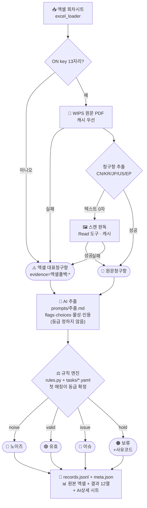

# 특허 판정 AI — 코드 구조도 (개발자용)

> AX 100일의 도전 · DOD 시범 · 코드 `~/dev/ax-patent-filter`
> 상위(비개발자용) 설명은 samyang `03_duty/13_ax_100days/특허필터링AI_구조도.md` 참조.

매주 신규 공개 특허 리스트를 **전 건 원문 청구항 근거로** 4등급(노이즈/유효/이슈/보류) 판정한다.
**사전 게이트 없음. LLM은 등급을 정하지 않는다.**

---

## 핵심 구조 — 추출 + 규칙 엔진

```
원문 청구항
   │
   ├─ [AI 추출]  agent.extract_facts · prompts/추출.md
   │     사실만 뽑는다: flags(yes/no/unclear) · choices · 물성 · 근거인용 · 독립청구항
   │     ⚠️ 라벨을 정하지 않는다
   │
   ├─ [정규화]  rules.normalize
   │     누락 flag → unclear · 미정의 choice 값 제거 (쓰레기 입력도 안전하게 보류로)
   │
   └─ [규칙 엔진]  rules.evaluate + tasks/*.yaml 의 rules
         위에서부터 첫 매칭 → 등급 확정 + 적용규칙ID + 보류사유 + 근거문장
```

**같은 추출값이면 항상 같은 등급.** LLM 자유 판정의 비재현성을 제거한 것이 이 설계의 목적이다
(IP전략팀 피드백 10.1).

규칙 우선순위 원칙 — `tasks/dod.yaml` 상단 주석에도 명시:
1. 근거 부족(원문 미확보)은 무엇보다 먼저 → 초록·대표청구항만으로 최종 판정 금지
2. 명백히 무관한 기술은 보류보다 **노이즈 우선**
3. 이슈 **제외** 규칙은 반드시 이슈 규칙보다 먼저 (안 그러면 제외가 무효)
4. 범위 불명은 비이슈로 단정하지 않고 **보류**

---

## 실행

```bash
cd ~/dev/ax-patent-filter
/opt/anaconda3/bin/streamlit run experiment/app.py   # 🧪 실험·검증
/opt/anaconda3/bin/streamlit run launch/app.py       # 🚀 배포
# CLI (회차 하나 + 엑셀 출력):
/opt/anaconda3/bin/python engine/pipeline.py "<엑셀>" 228회차 --task dod --limit 20 --excel
# 중단 이어가기:
/opt/anaconda3/bin/python engine/pipeline.py "<엑셀>" 228회차 --task dod --resume output/runs/<폴더>
# 규칙 회귀 테스트 (tasks/*.yaml 고친 뒤 필수):
/opt/anaconda3/bin/python tests/test_rules.py
```
> CLI·웹앱 모두 `pipeline.run()` 하나를 호출한다 → 체크포인트·규칙·리포트 로직이 한 벌.
> `pipeline.run` 은 시작 전에 `rules.lint()` 를 돌려 규칙이 깨져 있으면 **실행을 거부**한다.

### ⚠️ 구독 경로 옵션 4개는 절대 빼지 말 것
`agent._ask_subscription` 의 `ClaudeAgentOptions(allowed_tools=[], tools=[], setting_sources=[], skills=[])`.

| 옵션 조합 | 프롬프트 토큰 (실측 2026-08-21) |
|---|---|
| 옵션 없음 | **29,162** |
| `setting_sources=[]` 만 | 22,229 |
| **4개 전부** | **215** |

하나라도 빠지면 CLI가 자기 시스템 프롬프트·도구 정의·스킬 목록·`CLAUDE.md`를 프롬프트에 싣는다.
판정이 프롬프트 파일만의 함수가 아니게 되어 재현이 깨지고 구독 쿼터도 낭비된다.

---

## 처리 흐름 (`pipeline.run` → 건별 `judge_one`)

```
IN   엑셀 회차시트                                    [excel_loader.py]
        │
근거  gather_claims                                   [pipeline.py]
     ON key 13자리? ──아니오──▶ 엑셀 대표청구항   evidence=엑셀폴백:ONkey없음/형식오류
        │ 예
     WIPS PDF(캐시 우선) ──실패──▶ 엑셀 대표청구항  evidence=엑셀폴백:PDF실패
        │                                            [wips_downloader.py]
     청구항 추출 CN/KR/JP/US/EP                       [claims_extractor.py]
        ├ 텍스트 0자(스캔) ─▶ 에이전트 이미지 판독 ─▶ .claims.txt 캐시
        │                    실패 시 엑셀폴백:스캔판독실패
        ▼  evidence=원문청구항 (구간실패 시 원문전체)
추출  agent.extract_facts                             [agent.py · prompts/추출.md]
        ▼  flags / choices / properties / independent_claims / evidence / notes
등급  rules.normalize → rules.evaluate                [rules.py · tasks/*.yaml]
        ▼  label · rule_id · hold_code · reason · review_note
신뢰도 pipeline.confidence  (근거등급 + unclear 개수 + 보정경고 → 높음/중간/낮음)
        ▼
OUT  output/runs/<회차>_<시각>/
       records.jsonl  건별 append(즉시 flush) → --resume 으로 이어가기
       meta.json      프롬프트 전문 + **과제 yaml 전체** 스냅샷
       판정결과.xlsx  원본 엑셀 + 결과 열                [excel_export.py]
```

---

## 엑셀 출력 (`excel_export.annotate_workbook`)

원본은 **절대 수정하지 않고** 사본을 만든다. 헤더에서 `번호` 열을 찾아 행을 맞춘다(위치 가정 없음).

**회차 시트 오른쪽 12열** (228회차면 39열째 = `AM` 부터)
`AI판정 · AI신뢰도 · 보류 · 보류근거 · 노이즈 · 노이즈근거 · 유효 · 유효근거 · 이슈 · 이슈근거 · 근거청구항 · 검토필요사항`
- 4등급은 배타적이므로 O열 중 **하나만** 채워지고 근거도 하나만 찬다(연구원 요청 형식 유지)
- `AI판정` 열에 등급 색, 자동필터 범위를 새 열까지 확장
- 실측: 원본 워크북에 이미지·차트·병합셀·조건부서식이 0개라 openpyxl 왕복 시 유실 없음

**`<회차>_AI상세` 시트 36열** — 적용규칙 · 보류사유 · 기술요약 · 근거등급 · 추출경로 · `[F]` flag 8개 · `[C]` choice 3개 · `[P]` 물성 10개 · 근거청구항 · 근거인용 · 추출메모 · 검토필요사항 · 보정경고

---

## 파일 지도

| 파일 | 역할 |
|---|---|
| `pipeline.py` | `gather_claims`(근거) · `judge_one`(건별) · `confidence` · `run`(체크포인트·lint·진행콜백) · `report` |
| **`rules.py`** | **규칙 엔진** — `normalize`(추출값 보정) · `evaluate`(등급 확정) · `lint`(규칙 검사) |
| `agent.py` | `extract_facts`(사실 추출) · `read_claims_from_scan`(스캔 판독). 구독·API 분기, 토큰·파싱실패 집계 |
| `criteria.py` | `tasks/*.yaml`(v2) 로더 · `render_for_extract`(프롬프트용 렌더) · `field_names` |
| `excel_export.py` | 원본 엑셀에 결과 열 + 상세 시트 |
| `excel_loader.py` | 엑셀 읽기(pandas) + 컬럼 정규화 |
| `wips_downloader.py` | WIPS PDF (skey→POST→iframe→GET), 캐시 |
| `claims_extractor.py` | PDF → 청구항 (CN/KR/JP/US/EP), 스캔 감지 |
| `ui_common.py` | 공유 UI — 실행·판정기준 패널·결과 렌더·엑셀 다운로드 |
| `config.yaml`/`config.py` | 모델·백엔드·경로·상한·`features.scan_read` |
| `prompts/추출.md` · `prompts/스캔판독.md` | 에이전트 지시문 (과제 무관, 라벨 결정 안 함) |
| **`tasks/*.yaml`** | **과제 지식 전부** — scope · own_composition · extract · disambiguation · rules |
| `tests/test_rules.py` | 규칙 회귀 테스트 19케이스 (피드백 5·6·7장 그대로) |

---

## "AI가 뭘 근거로 판단하나" — 세 곳

| 무엇 | 어디 | 누가 고치나 |
|---|---|---|
| 원문을 어떻게 읽고 사실을 뽑나 | `prompts/추출.md` | 개발자 (과제 무관) |
| 무엇을 추출하나 · 무엇이 노이즈/유효/이슈/보류인가 | **`tasks/*.yaml`** | **과제 담당자·IP전략팀** |
| 모델·백엔드·상한·스캔판독 on/off | `config.yaml` | 개발자 |

> `tasks/*.yaml` 하나만 보여주면 "이게 우리가 이해한 판정 기준입니다" 가 성립한다. 그게 이 구조의 실익.

---

## 알려진 이슈

| 구분 | 내용 |
|---|---|
| 🔴 기준 | **자사 개발 조성의 함량·구조 범위 미확정** (`own_composition.composition_ranges`). 이슈 중첩 근거가 그만큼 약하다 → 임가현·IP전략팀 확인 필요 |
| 🔴 데이터 | **엑셀 원문키 회차별 불일치** — 정상=218~220·225~228 / 13자리 아님=221~224 / 컬럼없음=214~217. 221회차는 열 구조 자체가 밀림(51열, `title`에 `'P'`) → 열구조 통일 + `WIPSONkey` 포함 재추출 요청 |
| 🔴 코드 | **로더 입구 검증 없음** — 열이 밀려도 조용히 통과. `title` 길이·`on_key` 형식 sanity check 필요 |
| 🟠 성능 | 추출이 무거워져 건당 20~30초. 회차 1개(≈200건) 직렬 **70~100분 추정**. 판정 병렬화 미적용 |
| 🟠 비용 | 스캔 판독 231k~289k토큰·68~87초/건. 캐시로 1회만이나 최초 회차는 부담 |
| 🟡 UI | 판정 규칙을 **코딩 없이 편집하는 화면 미구현** (지금은 `tasks/*.yaml` 직접 수정). 피드백 10.2 화면 3 |
| 🟡 UI | 대시보드·연구원 최종 승인·수정 사유 누적(피드백 10.2·10.3) 미구현. SQLite 필요 |
| 🟡 검증 | 사람 라벨 정확도 미검증 → 성능 지표로 쓰지 않음. 이슈=O 사례가 2,826행 중 7건뿐(최근 6회차 0건) |
| ⚪ 테스트 | 규칙 엔진만 테스트 있음. `excel_loader`·`claims_extractor` 테스트 미작성 |

---

## Mermaid



---
*변경 이력: 2026-08-04 최초. 2026-08-21 ① 1차 게이트 제거 → 전 건 원문 판정 ② 근거등급·청구항 인용 ③ 체크포인트 ④ EP 추출기 ⑤ 구독 프롬프트 오염 수정 ⑥ 스캔 이미지 에이전트 판독+캐시 ⑦ **IP전략팀 피드백 반영: 4등급(보류 추가) · 추출+규칙엔진 · 과제 스키마 v2 · 엑셀 결과 열 출력**.*
